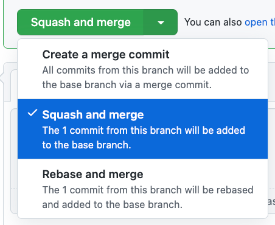

### No merge-squash extension

Chrome extension to hide the "Squash & Merge" buttons on GitHub pull requests.

#### How it works?
It hides:
* The green one that by default is the last one you used.
* The option from the dropdown menu.

#### Configuring the extension

On the options page you can configure the branch to hide the button for. By default, it's `main`.

It supports regex, so you can hide the button for multiple branches.

#### Installing the extension

TODO

#### Why?
This seems like a problem that many people share:
* [Related GitHub](https://github.com/community/community/discussions/10809)
* [Stack Overflow](https://stackoverflow.com/questions/65898390/is-there-a-way-to-disable-squash-and-merge-for-certain-branches-in-github)
